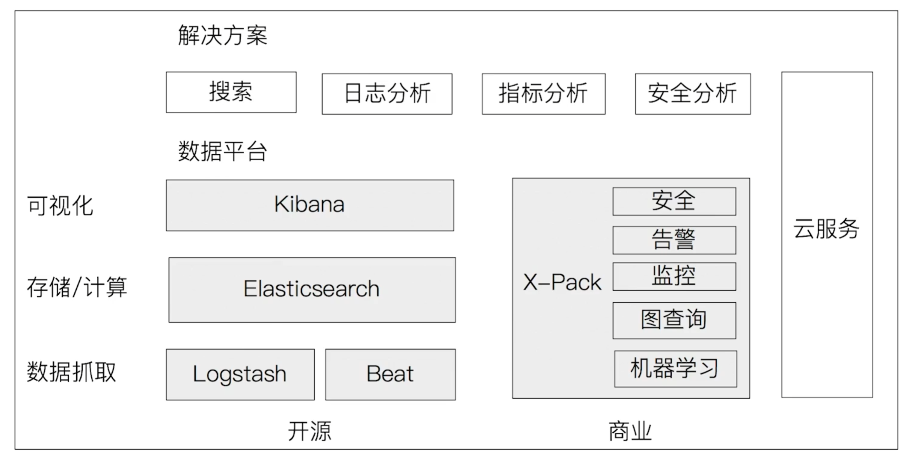

# elasticsearch

Elasticsearch 是一个分布式、高扩展、高实时的搜索与数据分析引擎。它能很方便的使大量数据具有搜索、分析和探索的能力。充分利用Elasticsearch的水平伸缩性，能使数据在生产环境变得更有价值。Elasticsearch基于Lucene。

## 主要功能

- 分布式搜索引擎
- 大数据近实时分析引擎

## 产品特性

- 高性能,和T+1说不
- 容易使用 
- 容易扩展

## Lucene优点

- 基于Java语言开发的搜索引擎类库
- 高性能,易扩展

## Lucene缺点

- 只能基于Java语言开发
- 类库的接口学习曲线陡峭
- 原生并不支持水平扩展

## Elastic Stack 生态圈

