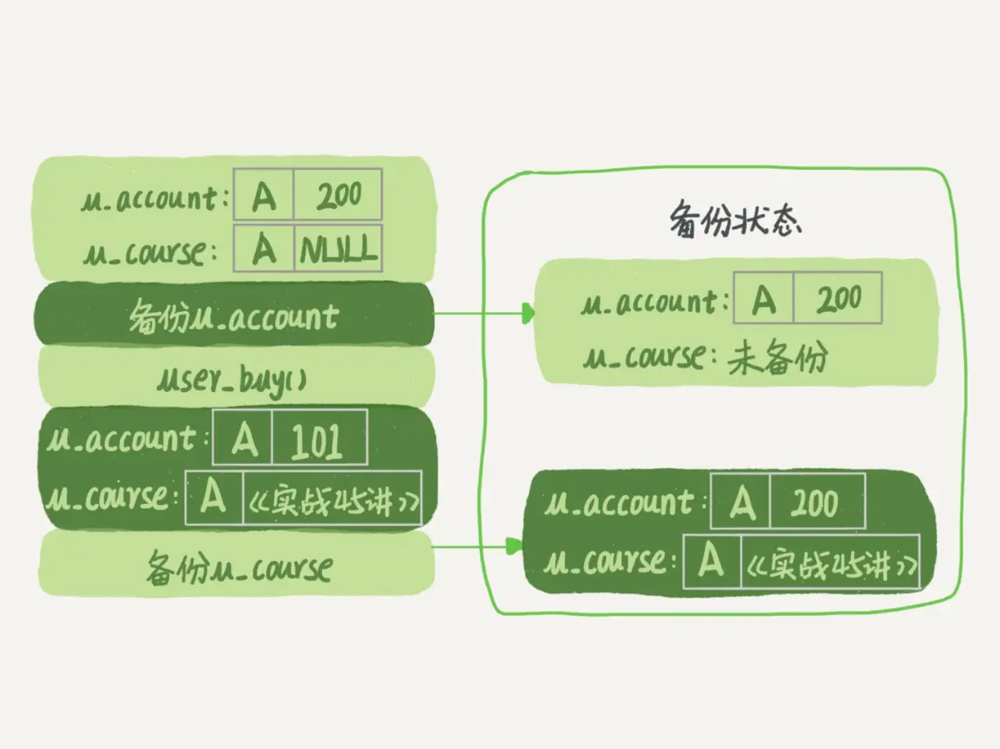
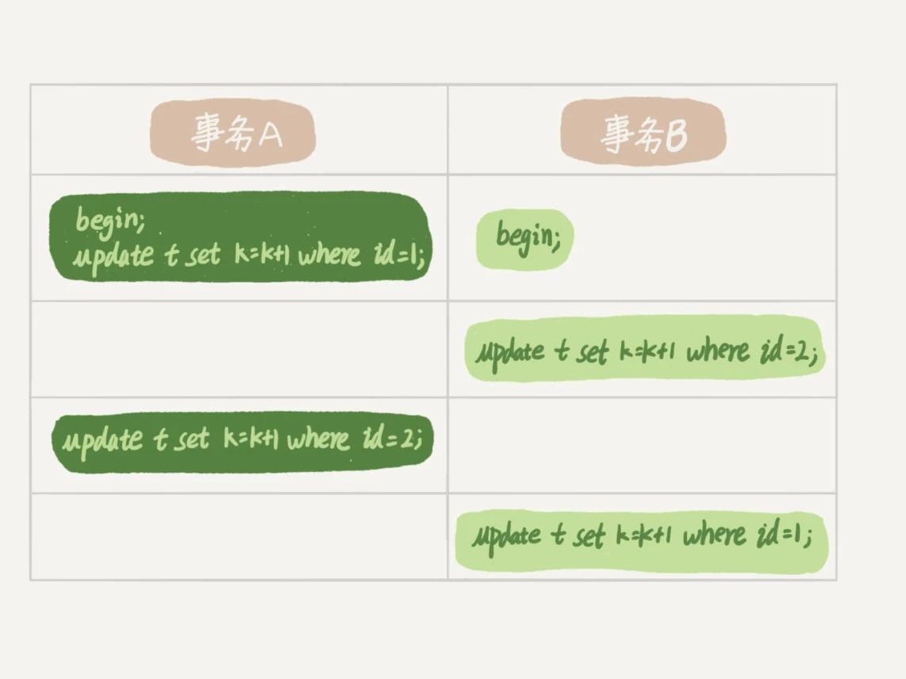

# Mysql的锁

数据库锁设计的初衷是处理并发问题。作为多用户共享的资源，当出现并发访问的时候，数据库需要合理地控制资源的访问规则。而锁就是用来实现这些访问规则的重要数据结构。

根据加锁的范围，MySQL 里面的锁大致可以分成**全局锁、表级锁和行锁**三类。

锁的设计比较复杂，文章不会涉及锁的具体实现细节，主要介绍的是碰到锁时的现象和其背后的原理。


## 全局锁

顾名思义，全局锁就是对整个数据库实例加锁。

MySQL 提供了一个**加全局读锁**的方法:

命令是  **Flush tables with read lock (FTWRL)**

```
unlock tables可以解除
```

当你需要让整个库处于只读状态的时候，可以使用这个命令，之后其他线程的以下语句会被**阻塞**：

- 数据更新语句（数据的增删改）
- 数据定义语句（包括建表、修改表结构等）
- 更新类事务的提交语句 


**全局锁的典型使用场景是，做全库逻辑备份**。也就是把整库每个表都 select 出来存成文本。

以前有一种做法，是通过 FTWRL 确保不会有其他线程对数据库做更新，然后对整个库做备份。**注意，在备份过程中整个库完全处于只读状态。**

但是让整库都只读，听上去就很危险：

- 如果你在主库上备份，那么在备份期间都不能执行更新，业务基本上就得停摆

- 如果你在从库上备份，那么备份期间从库不能执行主库同步过来的 binlog，会导致主从延迟

  ```
  如果是读写分离，从库负责Read，binlog不能停止且要保持实时性。
  ```

看来加全局锁不太好。但是细想一下，备份为什么要加锁呢？我们来看一下不加锁会有什么问题。

假设你现在要维护“网课”的购买系统，关注的是用户**账户余额表和用户课程表**。

现在发起一个逻辑备份。假设备份期间，有一个用户，他购买了一门课程，业务逻辑里就要扣掉他的余额，然后往已购课程里面加上一门课。

如果时间顺序上是先备份账户余额表 (u_account)，然后用户购买，然后备份用户课程表 (u_course)，会怎么样呢？你可以看一下这个图：



可以看到，这个备份结果里，用户 A 的数据状态是“账户余额没扣，但是用户课程表里面已经多了一门课”。如果后面用这个备份来恢复数据的话，用户 A 就发现，自己赚了。

作为用户可别觉得这样可真好啊，你可以试想一下：如果备份表的顺序反过来，先备份用户课程表再备份账户余额表，又可能会出现什么结果？

也就是说，不加锁的话，备份系统备份的得到的库不是一个逻辑时间点，这个**视图是逻辑不一致的**。

说到视图你肯定想起来了，我们在前面讲事务隔离的时候，其实是有一个方法能够拿到一致性视图的，对吧？

是的，就是在**可重复读隔离级别下开启一个事务**。

**官方自带的逻辑备份工具是 mysqldump。当 mysqldump 使用参数–single-transaction 的时候，导数据之前就会启动一个事务，来确保拿到一致性视图。而由于 MVCC 的支持，这个过程中数据是可以正常更新的。**

你一定在疑惑，有了这个功能，为什么还需要 FTWRL 呢？**一致性读是好，但前提是引擎要支持这个隔离级别**。比如，对于 MyISAM 这种不支持事务的引擎，如果备份过程中有更新，总是只能取到最新的数据，那么就破坏了备份的一致性。这时，我们就需要使用 FTWRL 命令了。

所以，**single-transaction 方法只适用于所有的表使用事务引擎的库**。如果有的表使用了不支持事务的引擎，那么备份就只能通过 FTWRL 方法。这往往是 DBA 要求业务开发人员使用 InnoDB 替代 MyISAM 的原因之一。

你也许会问，**既然要全库只读，为什么不使用 set global readonly=true 的方式呢？**确实 readonly 方式也可以让全库进入只读状态，但我还是会建议你用 FTWRL 方式，主要有两个原因：

- 一是，在有些系统中，readonly 的值会被用来做其他逻辑，比如用来判断一个库是主库还是备库。因此，修改 global 变量的方式影响面更大，我不建议你使用。
- 二是，在异常处理机制上有差异。如果执行 FTWRL 命令之后由于客户端发生异常断开，那么 MySQL 会自动释放这个全局锁，整个库回到可以正常更新的状态。而将整个库设置为 readonly 之后，如果客户端发生异常，则数据库就会一直保持 readonly 状态，这样会导致整个库长时间处于不可写状态，风险较高。

业务的更新不只是增删改数据（DML)，还有可能是加字段等修改表结构的操作（DDL）。不论是哪种方法，一个库被全局锁上以后，你要对里面任何一个表做加字段操作，都是会被锁住的。

但是，即使没有被全局锁住，加字段也不是就能一帆风顺的，因为你还会碰到接下来我们要介绍的表级锁。


## 表级锁

MySQL 里面表级别的锁有两种：**一种是表锁，一种是元数据锁（meta data lock，MDL)。**

**表锁的语法是 lock tables … read/write。**与 FTWRL 类似，可以用 unlock tables 主动释放锁，也可以在客户端断开的时候自动释放。需要注意，lock tables 语法除了会限制别的线程的读写外，也限定了本线程接下来的操作对象。

```
对表加读锁后，自己也不能对其进行修改;
自己和其他线程只能读取该表;
当对某个表执加上写锁后（lock table t2 write），该线程可以对这个表进行读写，其他线程对该表的读和写都受到阻塞;
该线程此时也不能读写其他未加锁的表;
```

举个例子:

--------------------------------------

如果在某个线程 A 中执行 

lock tables t1 read, t2 write; 

这个语句，则其他线程写 t1、读写 t2 的语句都会被阻塞。

同时，线程 A 在执行 unlock tables 之前，也只能执行读 t1、读写 t2 的操作。

连写 t1 都不允许，自然也不能访问其他表。

--------------------------------------


另一类**表级的锁是 MDL（metadata lock)**。MDL 不需要显式使用，在访问一个表的时候会被自动加上。MDL 的作用是，保证读写的正确性。你可以想象一下，如果一个查询正在遍历一个表中的数据，而执行期间另一个线程对这个表结构做变更，删了一列，那么查询线程拿到的结果跟表结构对不上，肯定是不行的。

因此，在 MySQL 5.5 版本中引入了 MDL，当对一个表做增删改查操作的时候，加 MDL 读锁；当要对表做结构变更操作的时候，加 MDL 写锁。

- 读锁之间不互斥，因此你可以有多个线程同时对一张表增删改查。
- 读写锁之间、写锁之间是互斥的，用来保证变更表结构操作的安全性。因此，如果有两个线程要同时给一个表加字段，其中一个要等另一个执行完才能开始执行。

**虽然 MDL 锁是系统默认会加的，但却是你不能忽略的一个机制**。比如下面这个例子，我经常看到有人掉到这个坑里：给一个小表加个字段，导致整个库挂了。

你肯定知道，给一个表加字段，或者修改字段，或者加索引，需要扫描全表的数据。在对大表操作的时候，你肯定会特别小心，以免对线上服务造成影响。而实际上，即使是小表，操作不慎也会出问题。我们来看一下下面的操作序列，假设表 t 是一个小表。[MYSQL版本为:5.6]


```
申请MDL锁的操作会形成一个队列，队列中写锁获取优先级高于读锁。
一旦出现写锁等待，不但当前操作会被阻塞，同时还会阻塞后续该表的所有操作。
事务一旦申请到MDL锁后，直到事务执行完才会将锁释放。
(
这里有种特殊情况如果事务中包含DDL操作
mysql会在DDL操作语句执行前
隐式提交commit
以保证该DDL语句操作作为一个单独的事务存在
同时也保证元数据排他锁的释放
例如id 44的语句改为
<begin;alter table testok add z varchar(10) not Null;select * from testok;>
此时一旦alter语句执行完成会马上提交事务（autocommit=1）
后面的select就在本次事务之外
其执行完成后不会持有读锁
)
```

我们可以看到 session A 先启动，这时候会对表 t 加一个 MDL 读锁。由于 session B 需要的也是 MDL 读锁，因此可以正常执行。

之后 session C 会被 blocked，是因为 session A 的 MDL 读锁还没有释放，而 session C 需要 MDL 写锁，因此只能被阻塞。

如果只有 session C 自己被阻塞还没什么关系，但是之后所有要在表 t 上新申请 MDL 读锁的请求也会被 session C 阻塞。前面我们说了，所有对表的增删改查操作都需要先申请 MDL 读锁，就都被锁住，等于这个表现在完全不可读写了。

如果某个表上的查询语句频繁，而且客户端有重试机制，也就是说超时后会再起一个新 session 再请求的话，这个库的线程很快就会爆满。

你现在应该知道了，**事务中的 MDL 锁，在语句执行开始时申请，但是语句结束后并不会马上释放，而会等到整个事务提交后再释放。**

基于上面的分析，我们来讨论一个问题，**如何安全地给小表加字段？**

首先我们要解决长事务，事务不提交，就会一直占着 MDL 锁。在 MySQL 的 **information_schema 库的 innodb_trx 表中，你可以查到当前执行中的事务**。如果你要做 DDL 变更的表刚好有长事务在执行，要考虑先暂停 DDL，或者 kill 掉这个长事务。

但考虑一下这个场景。如果你要变更的表是一个热点表，虽然数据量不大，但是上面的请求很频繁，而你不得不加个字段，你该怎么做呢？

这时候 kill 可能未必管用，因为新的请求马上就来了。比较理想的机制是，**在 alter table 语句里面设定等待时间，如果在这个指定的等待时间里面能够拿到 MDL 写锁最好，拿不到也不要阻塞后面的业务语句，先放弃**。之后开发人员或者 DBA 再**通过重试命令重复这个过程**。

```
重试机制
为了防止死锁或者长时间卡顿，通过加入超时时间的方法来解决。
```

MariaDB 已经合并了 AliSQL 的这个功能，所以这两个开源分支目前都支持 DDL NOWAIT/WAIT n 这个语法。

```
ALTER TABLE tbl_name NOWAIT add column ...
ALTER TABLE tbl_name WAIT N add column ... 
```


## 行锁

MySQL 的行锁是在引擎层**由各个引擎自己实现的。但并不是所有的引擎都支持行锁**，比如 MyISAM 引擎就不支持行锁。不支持行锁意味着并发控制只能使用表锁，对于这种引擎的表，同一张表上任何时刻只能有一个更新在执行，这就会影响到业务并发度。**InnoDB 是支持行锁的，这也是 MyISAM 被 InnoDB 替代的重要原因之一。**

我们今天就主要来聊聊 InnoDB 的行锁，以及如何通过减少锁冲突来提升业务并发度。

顾名思义，**行锁就是针对数据表中行记录的锁**。这很好理解，比如事务 A 更新了一行，而这时候事务 B 也要更新同一行，则必须等事务 A 的操作完成后才能进行更新。

当然，数据库中还有一些没那么一目了然的概念和设计，这些概念如果理解和使用不当，容易导致程序出现非预期行为，比如两阶段锁。


### 从两阶段锁说起

我先给你举个例子。在下面的操作序列中，事务 B 的 update 语句执行时会是什么现象呢？假设字段 id 是表 t 的主键。


这个问题的结论取决于事务 A 在执行完两条 update 语句后，持有哪些锁，以及在什么时候释放。你可以验证一下：实际上事务 B 的 update 语句会被阻塞，直到事务 A 执行 commit 之后，事务 B 才能继续执行。

知道了这个答案，你一定知道了事务 A 持有的两个记录的行锁，都是在 commit 的时候才释放的。

也就是说，**在 InnoDB 事务中，行锁是在需要的时候才加上的，但并不是不需要了就立刻释放，而是要等到事务结束时才释放。这个就是两阶段锁协议**。

```
事务中
行锁是在语句执行时才加上的
不是事务开始就加上
但释放是统一在事务结束时才释放
根据这个特性
对于高并发的行记录的操作语句就可以尽可能的安排到最后面
以减少锁等待的时间
提高并发性能
```

知道了这个设定，对我们使用事务有什么帮助呢？那就是，如果你的事务中需要锁多个行，要把最可能造成锁冲突、最可能影响并发度的锁尽量往后放。我给你举个例子。

```
并发编程中
我们在编写相应的并发程序时也要这么去考虑
就是尽量将容易引起并发度的操作就在合适的位置从而减少一次操作中锁住共享数据的时间
进而提升效率
```

假设你负责实现一个电影票在线交易业务，顾客 A 要在影院 B 购买电影票。我们简化一点，这个业务需要涉及到以下操作：

1. 从顾客 A 账户余额中扣除电影票价
2. 给影院 B 的账户余额增加这张电影票价
3. 记录一条交易日志

也就是说，要完成这个交易，我们需要 update 两条记录，并 insert 一条记录。当然，**为了保证交易的原子性，我们要把这三个操作放在一个事务中**。那么，你会怎样安排这三个语句在事务中的顺序呢？

试想如果同时有另外一个顾客 C 要在影院 B 买票，那么这两个事务冲突的部分就是语句 2 了。因为它们要更新同一个影院账户的余额，需要修改同一行数据。

根据两阶段锁协议，不论你怎样安排语句顺序，所有的操作需要的行锁都是在事务提交的时候才释放的。所以，如果你把语句 2 安排在最后，比如按照 3、1、2 这样的顺序，那么影院账户余额这一行的锁时间就最少。这就最大程度地减少了事务之间的锁等待，提升了并发度。

好了，现在由于你的正确设计，影院余额这一行的行锁在一个事务中不会停留很长时间。但是，这并没有完全解决你的困扰。

如果这个影院做活动，可以低价预售一年内所有的电影票，而且这个活动只做一天。于是在活动时间开始的时候，你的 MySQL 就挂了。你登上服务器一看，CPU 消耗接近 100%，但整个数据库每秒就执行不到 100 个事务。这是什么原因呢？

这里，我就要说到**死锁和死锁检测**了。


## 死锁和死锁检测

当并发系统中不同线程出现循环资源依赖，涉及的线程都在等待别的线程释放资源时，就会导致这几个线程都进入无限等待的状态，称为死锁。这里我用数据库中的行锁举个例子。



这时候，事务 A 在等待事务 B 释放 id=2 的行锁，而事务 B 在等待事务 A 释放 id=1 的行锁。 事务 A 和事务 B 在互相等待对方的资源释放，就是进入了死锁状态。当出现死锁以后，有两种策略：

- 一种策略是，直接进入等待，直到超时。这个超时时间可以通过参数 innodb_lock_wait_timeout 来设置。
- 另一种策略是，发起死锁检测，发现死锁后，主动回滚死锁链条中的某一个事务，让其他事务得以继续执行。将参数 innodb_deadlock_detect 设置为 on，表示开启这个逻辑。

在 InnoDB 中，innodb_lock_wait_timeout 的默认值是 50s，意味着如果采用第一个策略，当出现死锁以后，第一个被锁住的线程要过 50s 才会超时退出，然后其他线程才有可能继续执行。对于在线服务来说，这个等待时间往往是无法接受的。

但是，我们又不可能直接把这个时间设置成一个很小的值，比如 1s。这样当出现死锁的时候，确实很快就可以解开，但如果不是死锁，而是简单的锁等待呢？所以，**超时时间设置太短的话，会出现很多误伤**。

所以，正常情况下我们还是要采用第二种策略，即：主动死锁检测，而且 innodb_deadlock_detect 的默认值本身就是 on。**主动死锁检测在发生死锁的时候，是能够快速发现并进行处理的，但是它也是有额外负担的**。

你可以想象一下这个过程：每当一个事务被锁的时候，就要看看它所依赖的线程有没有被别人锁住，如此循环，最后判断是否出现了循环等待，也就是死锁。

那如果是我们上面说到的所有事务都要更新同一行的场景呢？

每个新来的被堵住的线程，都要判断会不会由于自己的加入导致了死锁，这是一个时间复杂度是 O(n) 的操作。假设有 1000 个并发线程要同时更新同一行，那么死锁检测操作就是 100 万这个量级的。虽然最终检测的结果是没有死锁，但是这期间要消耗大量的 CPU 资源。因此，你就会看到 CPU 利用率很高，但是每秒却执行不了几个事务。

根据上面的分析，我们来讨论一下，**怎么解决由这种热点行更新导致的性能问题呢**？问题的症结在于，**死锁检测要耗费大量的 CPU 资源**。

```
热点行更新的解决策略: 降低并发度 
1. 拆行，一行拆多行 
2. Server 层限流，即同一时间进入更新的线程数 
3. 关闭死锁监测（关闭的弊端是可能超时较多）
```

- 一种头痛医头的方法，就是如果你能确保这个业务一定不会出现死锁，可以**临时把死锁检测关掉**。但是这种操作本身带有一定的风险，因为业务设计的时候一般不会把死锁当做一个严重错误，毕竟出现死锁了，就回滚，然后通过业务重试一般就没问题了，这是业务无损的。而关掉死锁检测意味着可能会出现大量的超时，这是业务有损的。

- 另一个思路是**控制并发度**。根据上面的分析，你会发现如果并发能够控制住，比如同一行同时最多只有 10 个线程在更新，那么死锁检测的成本很低，就不会出现这个问题。一个直接的想法就是，在客户端做并发控制。但是，你会很快发现这个方法不太可行，因为客户端很多。我见过一个应用，有 600 个客户端，这样即使每个客户端控制到只有 5 个并发线程，汇总到数据库服务端以后，峰值并发数也可能要达到 3000。

因此，这个并发控制要做在数据库服务端。如果你有中间件，可以考虑在中间件实现；如果你的团队有能修改 MySQL 源码的人，也可以做在 MySQL 里面。基本思路就是，对于相同行的更新，在进入引擎之前排队。这样在 InnoDB 内部就不会有大量的死锁检测工作了。

可能你会问，如果团队里暂时没有数据库方面的专家，不能实现这样的方案，能不能从设计上优化这个问题呢？

你可以考虑通过将一行改成逻辑上的多行来减少锁冲突。还是以影院账户为例，可以考虑放在多条记录上，比如 10 个记录，影院的账户总额等于这 10 个记录的值的总和。这样每次要给影院账户加金额的时候，随机选其中一条记录来加。这样每次冲突概率变成原来的 1/10，可以减少锁等待个数，也就减少了死锁检测的 CPU 消耗。

```
分段汇总
Java原子类LongAdder也使用了这个原理[分段锁]。
```

这个方案看上去是无损的，但其实这类方案需要根据业务逻辑做详细设计。如果账户余额可能会减少，比如退票逻辑，那么这时候就需要考虑当一部分行记录变成 0 的时候，代码要有特殊处理。


## 小结

全局锁主要用在逻辑备份过程中。对于全部是 InnoDB 引擎的库，我建议你选择使用–single-transaction 参数，对应用会更友好。

表锁一般是在数据库引擎不支持行锁的时候才会被用到的。如果你发现你的应用程序里有 lock tables 这样的语句，你需要追查一下，比较可能的情况是：

- 要么是你的系统现在还在用 MyISAM 这类不支持事务的引擎，那要安排升级换引擎；
- 要么是你的引擎升级了，但是代码还没升级。我见过这样的情况，最后业务开发就是把 lock tables 和 unlock tables 改成 begin 和 commit，问题就解决了。

MDL 会直到事务提交才释放，在做表结构变更的时候，你一定要小心不要导致锁住线上查询和更新。

在讲述行锁时 , 我以两阶段协议为起点，和你一起讨论了在开发的时候如何安排正确的事务语句。这里的原则 / 我给你的建议是：如果你的事务中需要锁多个行，要把最可能造成锁冲突、最可能影响并发度的锁的申请时机尽量往后放。

但是，调整语句顺序并不能完全避免死锁。所以我们引入了死锁和死锁检测的概念，以及提供了三个方案，来减少死锁对数据库的影响。减少死锁的主要方向，就是控制访问相同资源的并发事务量。


## 问题
### 问题一:

备份一般都会在备库上执行，你在用–single-transaction 方法做逻辑备份的过程中，如果主库上的一个小表做了一个 DDL，比如给一个表上加了一列。这时候，从备库上会看到什么现象呢？

假设这个 DDL 是针对表 t1 的， 这里我把备份过程中几个关键的语句列出来：

```sql
Q1:SET SESSION TRANSACTION ISOLATION LEVEL REPEATABLE READ;
Q2:START TRANSACTION  WITH CONSISTENT SNAPSHOT；
/* other tables */
Q3:SAVEPOINT sp;
/* 时刻 1 */
Q4:show create table `t1`;
/* 时刻 2 */
Q5:SELECT * FROM `t1`;
/* 时刻 3 */
Q6:ROLLBACK TO SAVEPOINT sp;
/* 时刻 4 */
/* other tables */
```

在备份开始的时候，为了确保 RR（可重复读）隔离级别，再设置一次 RR 隔离级别 (Q1);

启动事务，这里用 WITH CONSISTENT SNAPSHOT 确保这个语句执行完就可以得到一个一致性视图（Q2)；

设置一个保存点，这个很重要（Q3）；

show create 是为了拿到表结构 (Q4)，然后正式导数据 （Q5），回滚到 SAVEPOINT sp，在这里的作用是释放 t1 的 MDL 锁 （Q6）。当然这部分属于“超纲”，上文正文里面都没提到。

DDL 从主库传过来的时间按照效果不同，我打了四个时刻。题目设定为小表，我们假定到达后，如果开始执行，则很快能够执行完成。

答案:

1. 如果在 Q4 语句执行之前到达，现象：没有影响，备份拿到的是 DDL 后的表结构。
2. 如果在“时刻 2”到达，则表结构被改过，Q5 执行的时候，报 Table definition has changed, please retry transaction，现象：mysqldump 终止；
3. 如果在“时刻 2”和“时刻 3”之间到达，mysqldump 占着 t1 的 MDL 读锁，binlog 被阻塞，现象：主从延迟，直到 Q6 执行完成。
4. 从“时刻 4”开始，mysqldump 释放了 MDL 读锁，现象：没有影响，备份拿到的是 DDL 前的表结构。


### 问题二:

如果你要删除一个表里面的前 10000 行数据，有以下三种方法可以做到：

第一种，直接执行 delete from T limit 10000;

第二种，在一个连接中循环执行 20 次 delete from T limit 500;

第三种，在 20 个连接中同时执行 delete from T limit 500。

你会选择哪一种方法呢？为什么呢？


答案:

第二种方式是相对较好的

第一种方式（即：直接执行 delete from T limit 10000）里面，单个语句占用时间长，锁的时间也比较长；而且大事务还会导致主从延迟

。第三种方式（即：在 20 个连接中同时执行 delete from T limit 500），会人为造成锁冲突。
