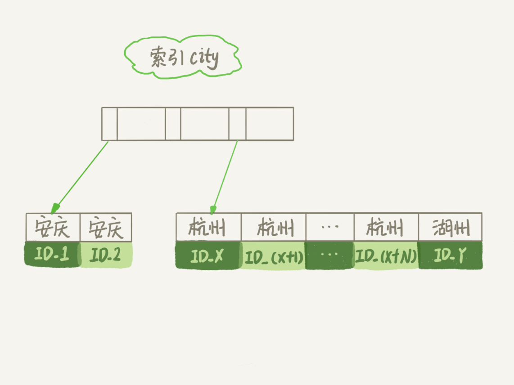

# order by是怎么工作的？

在你开发应用的时候，一定会经常碰到需要根据指定的字段排序来显示结果的需求。还是以我们前面举例用过的市民表为例，假设你要查询城市是“杭州”的所有人名字，并且按照姓名排序返回前 1000 个人的姓名、年龄。

假设这个表的部分定义是这样的：

```sql
CREATE TABLE `t` (
  `id` int(11) NOT NULL,
  `city` varchar(16) NOT NULL,
  `name` varchar(16) NOT NULL,
  `age` int(11) NOT NULL,
  `addr` varchar(128) DEFAULT NULL,
  PRIMARY KEY (`id`),
  KEY `city` (`city`)
) ENGINE=InnoDB;
```

这时，你的 SQL 语句可以这么写：

```sql
select city,name,age 
from t 
where city='杭州' 
order by name 
limit 1000 ;
```

这个语句看上去逻辑很清晰，但是你了解它的执行流程吗？今天，我就和你聊聊这个语句是怎么执行的，以及有什么参数会影响执行的行为。


## 全字段排序

前面我们介绍过索引，所以你现在就很清楚了，为避免全表扫描，我们需要在 city 字段加上索引。

在 city 字段上创建索引之后，我们用 explain 命令来看看这个语句的执行情况。


Extra 这个字段中的“Using filesort”表示的就是需要排序，MySQL 会给每个线程分配一块内存用于排序，称为 sort_buffer。

为了说明这个 SQL 查询语句的执行过程，我们先来看一下 city 这个索引的示意图。



从图中可以看到，满足 city='杭州’条件的行，是从 ID_X 到 ID_(X+N) 的这些记录。

通常情况下，这个语句执行流程如下所示 ：

1. 初始化 sort_buffer，确定放入 name、city、age 这三个字段；
2. 从索引 city 找到第一个满足 city='杭州’条件的主键 id，也就是图中的 ID_X；
3. 到主键 id 索引取出整行，取 name、city、age 三个字段的值，存入 sort_buffer 中；
4. 从索引 city 取下一个记录的主键 id；
5. 重复步骤 3、4 直到 city 的值不满足查询条件为止，对应的主键 id 也就是图中的 ID_Y；
6. 对 sort_buffer 中的数据按照字段 name 做快速排序；
7. 按照排序结果取前 1000 行返回给客户端。

我们暂且把这个排序过程，称为全字段排序，执行流程的示意图如下所示，下一篇文章中我们还会用到这个排序。


图中“按 name 排序”这个动作，可能在内存中完成，也可能需要使用外部排序，这取决于排序所需的内存和参数 sort_buffer_size。

sort_buffer_size，就是 MySQL 为排序开辟的内存（sort_buffer）的大小。如果要排序的数据量小于 sort_buffer_size，排序就在内存中完成。但如果排序数据量太大，内存放不下，则不得不利用磁盘临时文件辅助排序。

你可以用下面介绍的方法，来确定一个排序语句是否使用了临时文件。

```sql

/* 打开optimizer_trace，只对本线程有效 */
SET optimizer_trace='enabled=on'; 

/* @a保存Innodb_rows_read的初始值 */
select VARIABLE_VALUE into @a from  performance_schema.session_status where variable_name = 'Innodb_rows_read';

/* 执行语句 */
select city, name,age from t where city='杭州' order by name limit 1000; 

/* 查看 OPTIMIZER_TRACE 输出 */
SELECT * FROM `information_schema`.`OPTIMIZER_TRACE`\G

/* @b保存Innodb_rows_read的当前值 */
select VARIABLE_VALUE into @b from performance_schema.session_status where variable_name = 'Innodb_rows_read';

/* 计算Innodb_rows_read差值 */
select @b-@a;
```

这个方法是通过查看 OPTIMIZER_TRACE 的结果来确认的，你可以从 number_of_tmp_files 中看到是否使用了临时文件。


number_of_tmp_files 表示的是，排序过程中使用的临时文件数。你一定奇怪，为什么需要 12 个文件？内存放不下时，就需要使用外部排序，外部排序一般使用归并排序算法。可以这么简单理解，**MySQL 将需要排序的数据分成 12 份，每一份单独排序后存在这些临时文件中。然后把这 12 个有序文件再合并成一个有序的大文件**。

如果 sort_buffer_size 超过了需要排序的数据量的大小，number_of_tmp_files 就是 0，表示排序可以直接在内存中完成。

否则就需要放在临时文件中排序。sort_buffer_size 越小，需要分成的份数越多，number_of_tmp_files 的值就越大。

接下来，我再和你解释一下图 4 中其他两个值的意思。
