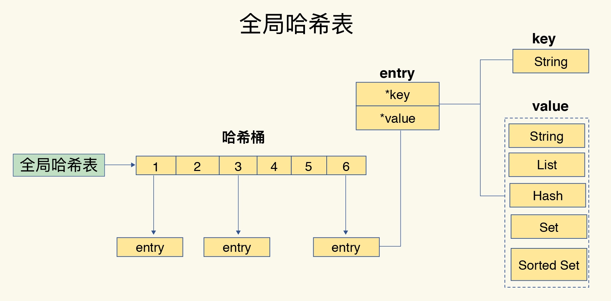
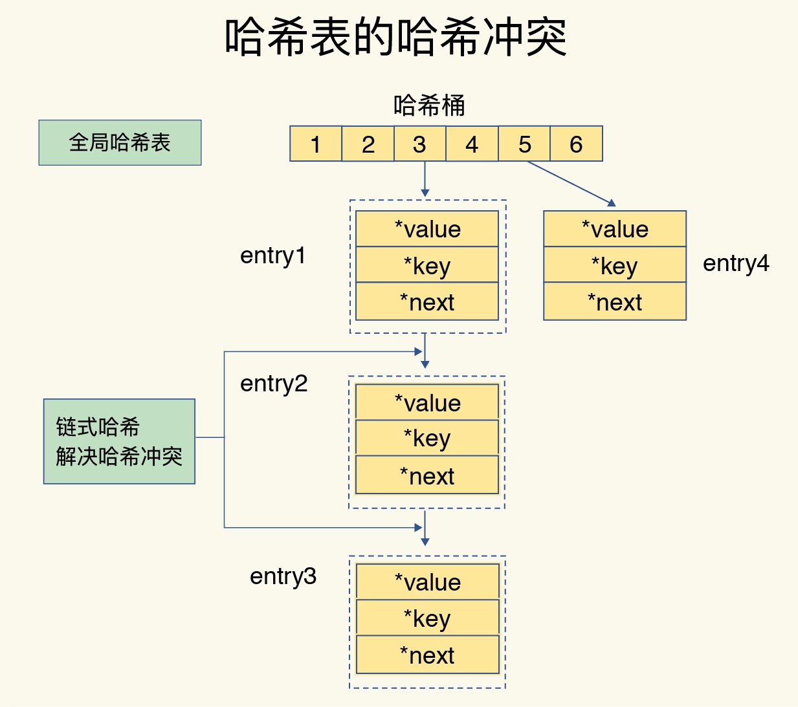

# Redis的数据结构

Redis非常的"快"。

它接收到一个键值对操作后，能以 <span class="font-first"> 微秒</span> 级别的速度找到数据，并快速完成操作。


## 为什么 Redis 有这么好的表现

- 一方面，这是因为它是内存数据库，所有操作都在内存上完成，内存的访问速度本身就很快。

- 另一方面，这要归功于它的数据结构。这是因为，键值对是按一定的数据结构来组织的，操作键值对最终就是对数据结构进行增删改查操作，所以高效的数据结构是 Redis 快速处理数据的基础。

## 常见的数据类型

- String 

  ```
  二进制安全的字符串,Redis中所有的key都是字符串类型。
  ```

- List

  ```
  按插入顺序排序的字符串元素的集合。他们基本上就是链表（linked lists）。
  ```

- Hash

  ```
  是由与值关联的字段组成的映射。字段和值都是字符串。
  ```

- Set

  ```
  不重复且无序的字符串元素的集合。
  ```

- Sorted Set
  ```
  类似Sets,但是每个字符串元素都关联到一个叫score浮动数值（floating number value）。里面的元素总是通过score进行着排序，所以不同的是，它是可以检索的一系列元素。
  ```

- <span class="font-first">以上这些只是 Redis 键值对中值的数据类型，也就是数据的保存形式。</span>


底层数据结构一共有 6 种，分别是简单动态字符串、双向链表、压缩列表、哈希表、跳表和整数数组。它们和数据类型的对应关系如下图所示：


String 类型的底层实现只有一种数据结构，也就是简单动态字符串。

而 List、Hash、Set 和 Sorted Set 这四种数据类型，都有两种底层实现结构。

通常情况下，我们会把这四种类型称为集合类型，它们的特点是一个键对应了一个集合的数据。


## 其他的数据类型

- Streams
  
  ```
  Stream 是 Redis 5.0 引入的一种新数据类型，它以更抽象的方式对日志数据结构进行建模。
  然而，日志的本质仍然完好无损：就像日志文件一样，通常以仅附加模式打开的文件实现，Redis Streams 主要是仅附加数据结构。
  至少在概念上，由于作为内存中表示的抽象数据类型，Redis Streams 实现了强大的操作来克服日志文件的局限性。
  尽管数据结构本身非常简单，但使 Redis 流成为最复杂的 Redis 类型的原因是它实现了额外的非强制性功能：一组阻塞操作，允许消费者等待生产者添加到流中的新数据，此外还有一个叫做Consumer Groups的概念。
  消费者组最初是由流行的消息传递系统 Kafka (TM) 引入的。Redis 用完全不同的术语重新实现了一个类似的想法，但目标是相同的：允许一组客户端合作使用同一消息流的不同部分。
  ```
  
- Bit arrays (or simply bitmaps)
  
  ```
  使用特殊命令可以像处理位数组一样处理字符串值：您可以设置和清除单个位，计算所有设置为 1 的位，找到第一个设置或未设置的位，等等。
  ```
  
- HyperLogLogs
  ```
  这是一种概率数据结构，用于估计集合的基数。
  ```

- GeoHash
  
  ```
  一种基于Sorted Set + GeoHash编码组合进行存储经纬度信息的一种数据结构。
  ```


## 键和值用什么结构组织？

为了实现从键到值的快速访问，Redis 使用了一个哈希表来保存所有键值对。

一个哈希表，其实就是一个数组，数组的每个元素称为一个哈希桶。所以，我们常说，一个哈希表是由多个哈希桶组成的，每个哈希桶中保存了键值对数据。

哈希桶中的元素保存的并不是值本身，而是指向具体值的指针。这也就是说，不管值是 String，还是集合类型，哈希桶中的元素都是指向它们的指针。

在下图中，可以看到，哈希桶中的 entry 元素中保存了**key**和**value**指针，分别指向了实际的键和值，这样一来，即使值是一个集合，也可以通过**value**指针被查找到。



因为这个哈希表保存了所有的键值对，所以它也被称为全局哈希表。哈希表的最大好处很明显，就是让我们可以用 O(1) 的时间复杂度来快速查找到键值对——我们只需要计算键的哈希值，就可以知道它所对应的哈希桶位置，然后就可以访问相应的 entry 元素。

查找过程主要依赖于哈希计算，和数据量的多少并没有直接关系。也就是说，不管哈希表里有 10 万个键还是 100 万个键，只需要一次计算就能找到相应的键。


## 为什么哈希表操作变慢了？

当你往哈希表中写入更多数据时，哈希冲突是不可避免的问题。这里的哈希冲突，也就是指，两个 key 的哈希值和哈希桶计算对应关系时，正好落在了同一个哈希桶中。

毕竟，哈希桶的个数通常要少于 key 的数量，这也就是说，难免会有一些 key 的哈希值对应到了同一个哈希桶中。

Redis 解决哈希冲突的方式，就是链式哈希。链式哈希也很容易理解，就是<span class="font-first">指同一个哈希桶中的多个元素用一个链表来保存，它们之间依次用指针连接。</span>

如下图所示：**entry1**、**entry2** 和 **entry3** 都需要保存在哈希桶 3 中，导致了哈希冲突。此时，**entry1** 元素会通过一个next指针指向 **entry2**，同样，**entry2** 也会通过next指针指向 **entry3**。这样一来，即使哈希桶 3 中的元素有 100 个，我们也可以通过 **entry** 元素中的指针，把它们连起来。这就形成了一个链表，也叫作哈希冲突链。


