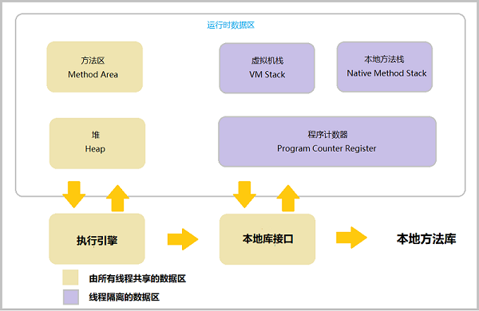

## Java虚拟机运行时数据区域

----------------------------------------

### 程序计数器

**程序计数器** 是一个记录着当前线程所执行的字节码的 行号指示器。

字节码的解释器的工作就是通过改变这个计数器的值来选取下一条需要执行的字节码指令。

它是 程序控制流的指示器

分支，循环，跳转，异常处理，线程恢复等基础功能都需要依赖程序计数器来完成。

### Java虚拟机栈

### 本地方法栈

### Java堆

### 方法区

----------------------------------------

### 运行时常量池

### 直接内存

----------------------------------------

## 内存溢出异常

